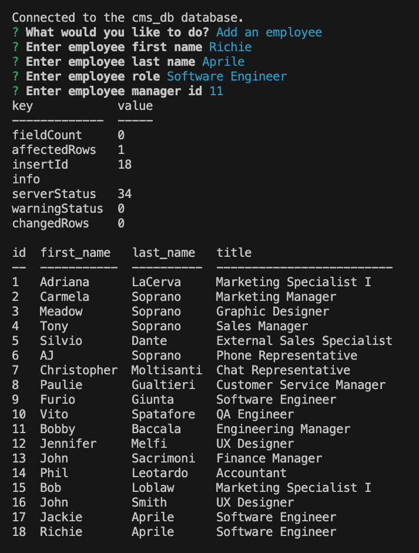

# employee-cms

## Description

This project allows users to easily view and interact with an employee database through a command line application. Users can view existing employee and department data, as well as modify that data and add new data to the database. 

See this project in github: https://github.com/whitbreezy/employee-CMS

Walkthrough Video: https://drive.google.com/file/d/1G8udsAI2-0EGO0CiNhMGsRp7Nz280_n8/view

## Installation

To install this project, clone or fork the code to your machine from my github (linked in the section above). Once installed, the application can be started by sourcing the schema and seeds files in mysql, then typing "npm start" into the command line.

## Usage

This is a command line application that can be invoked by entering "npm start" in the command line. Make sure you set up the schema and seed the data by running the mysql commands SOURCE db/schema.sql and SOURCE db/seeds.sql before invoking the application in the command line.

Below is a screenshot of the application being used to add an employee named Richie Aprile to the employees table in the database:

## Credits

I referenced my bootcamp class notes for help on this project. I also referenced the following github repo for some help with using inquirer prompts for sql queries: https://github.com/jpd61/employee-tracker/tree/master

## License

See repo for license info
